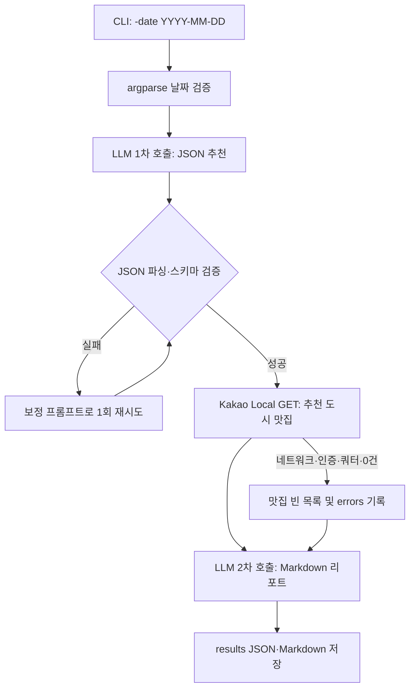

# AI 활용 학습 A1-2: 국내 여행 추천 CLI

**날짜를 입력하면 OpenAI 계열 LLM과 Kakao Local API를 순서대로 호출하여 국내 여행 추천 리포트를 생성하는 Python CLI 프로그램**입니다. 첫 번째 LLM 호출은 날짜에 맞는 추천 지역·계절 날씨·행사 후보를 엄격한 JSON으로 만들고, 그 JSON의 `recommended_city`를 Kakao Local API 검색어에 연결합니다. 이어서 맛집 결과까지 포함한 입력을 두 번째 LLM에 전달하여 Markdown 여행 리포트를 완성합니다.

> 이 과제의 핵심은 실시간 날씨나 행사 정보의 정답률이 아니라, **구조화된 LLM 출력이 다음 외부 API 호출의 입력으로 이어지는 흐름**을 안전하게 구현하는 것입니다.

| 구성 요소 | 선택한 제공자 | 프로그램에서의 역할 |
|---|---|---|
| LLM API | OpenAI 호환 Chat Completions API | 추천 JSON 생성 및 최종 Markdown 리포트 생성 |
| 장소 검색 API | Kakao Local 키워드 검색 API | 추천 도시의 맛집 최대 5곳 검색 |
| CLI | Python `argparse` | 필수 날짜 입력 검증 및 실행 제어 |
| 결과 파일 | JSON, Markdown | 원본 API 처리 결과·오류 요약과 최종 리포트 저장 |

## 프로젝트 구조

```text
AI 활용 학습 A1-2/
├── travel_planner.py          # 실행 프로그램
├── README.md                  # 개요·설치·실행·보안 안내
├── 과제수행과정.md             # 구현 과정과 설계 설명
├── 요구사항_체크리스트.md       # 요구사항별 충족 여부 검증
├── requirements.txt           # Python 의존성
├── .env.example               # 키 이름만 담은 환경변수 예시
├── .gitignore                 # 실제 키와 실행 산출물 보호 규칙
└── results/
    ├── YYYY-MM-DD_travel_data.json
    └── YYYY-MM-DD_travel_plan.md
```

## 설치와 실행

Python **3.10 이상**에서 실행합니다. 아래 명령은 프로젝트 폴더에서 수행합니다.

```bash
python -m venv .venv
source .venv/bin/activate              # Windows PowerShell: .venv\Scripts\Activate.ps1
pip install -r requirements.txt
cp .env.example .env                   # Windows PowerShell: Copy-Item .env.example .env
```

`.env` 파일을 열어 본인의 키를 입력한 후 실행합니다. `OPENAI_MODEL`은 생략할 수 있으며, 생략 시 `gpt-5-mini`를 사용합니다. OpenAI 호환 프록시를 이용하는 환경에서는 필요에 따라 `OPENAI_API_BASE`도 설정할 수 있습니다.

```dotenv
OPENAI_API_KEY=YOUR_OPENAI_API_KEY
KAKAO_REST_API_KEY=YOUR_KAKAO_REST_API_KEY
OPENAI_MODEL=gpt-5-mini
# OPENAI_API_BASE=https://api.openai.com/v1
```

```bash
python travel_planner.py -date "2026-10-03"
# 또는
python travel_planner.py --date "2026-10-03"
```

정상 실행 시 진행 로그와 저장 경로가 출력됩니다. `-date`는 필수이며, 실제 달력에 존재하는 `YYYY-MM-DD` 형식이 아니면 `argparse`가 사용법을 출력하고 종료합니다.

```text
[1/3] 1차 추천 생성 중(LLM)...
  - recommended_city: 강릉
[2/3] 맛집 검색 중(Kakao Local API)...
  - 맛집 5곳 검색 완료
[3/3] 최종 리포트 생성 중(LLM)...
  - 리포트 생성 완료
완료! results/2026-10-03_travel_plan.md 및 results/2026-10-03_travel_data.json를 확인하세요.
```

## 결과 확인 방법

실행 날짜를 기준으로 `results/` 폴더에 두 파일이 생성됩니다. JSON은 후속 분석이나 디버깅을 위한 원본 처리 데이터이고, Markdown은 사용자가 바로 읽는 최종 여행 리포트입니다.

| 파일 | 필수 포함 내용 | 용도 |
|---|---|---|
| `YYYY-MM-DD_travel_data.json` | `recommendation`, `restaurants`, `errors` | LLM 1차 JSON, 맛집 목록, 오류 요약 확인 |
| `YYYY-MM-DD_travel_plan.md` | 추천 지역·이유, 날씨, 행사, 맛집, 1일 일정, 오류 요약 | 읽기 쉬운 최종 여행 리포트 |

맛집 API가 실패하거나 검색 결과가 0건인 경우에도 프로그램은 중단하지 않습니다. 이 경우 JSON의 `restaurants`는 빈 배열이 되고, `errors`에 원인을 남기며, 리포트의 맛집 섹션은 **데이터 없음**으로 표기됩니다.

## API 키 발급 및 설정

OpenAI API 키는 [OpenAI API 키 페이지](https://platform.openai.com/api-keys)에서, Kakao REST API 키는 [Kakao Developers](https://developers.kakao.com/)에서 발급합니다. Kakao Developers에서 애플리케이션을 만든 뒤 REST API 키를 사용합니다. Kakao Local 키워드 검색은 인증 헤더에 `Authorization: KakaoAK {REST_API_KEY}` 형식을 사용합니다.[2]

`.env` 사용이 어려운 경우에는 현재 터미널 세션의 환경변수로 설정할 수도 있습니다.

| 운영체제/셸 | 설정 예시 |
|---|---|
| macOS/Linux | `export OPENAI_API_KEY="YOUR_KEY"`<br>`export KAKAO_REST_API_KEY="YOUR_KEY"` |
| Windows PowerShell | `$env:OPENAI_API_KEY="YOUR_KEY"`<br>`$env:KAKAO_REST_API_KEY="YOUR_KEY"` |

## API 요청 흐름과 오류 처리

OpenAI Chat Completions는 요청 본문을 담아 `POST`로 호출하고, 프로그램은 `response_format`의 JSON Schema를 사용해 1차 응답 형식을 제한합니다.[1] 반면 Kakao Local 키워드 검색은 검색 조건을 쿼리 파라미터로 전달하는 `GET` 요청입니다.[2] 즉, 일반적으로 **GET은 데이터를 조회**하고 **POST는 서버에 처리할 데이터를 전달하여 생성·변경 작업을 요청**할 때 사용합니다. 여기서는 LLM 생성 요청에는 POST, 장소 조회에는 GET을 사용합니다.



| 상황 | 프로그램 동작 | 결과 |
|---|---|---|
| `OPENAI_API_KEY` 없음 | 즉시 종료하고 설정 방법 출력 | 불완전한 결과물을 만들지 않음 |
| Kakao 키 없음·401/403·429·네트워크 오류 | 맛집을 빈 목록으로 처리하고 계속 진행 | 리포트 생성, `errors` 기록 |
| Kakao 검색 0건 | 중단하지 않고 계속 진행 | 리포트에 `데이터 없음`, `EMPTY_RESULT` 기록 |
| LLM 추천 JSON 파싱·필수 키 검증 실패 | 보정 지시로 최대 1회 재요청 | 재실패 시 명확한 오류 메시지와 종료 |
| 최종 리포트 LLM 호출 실패 | 확보한 원본 데이터로 대체 Markdown 작성 | 결과 파일은 남기고 오류를 기록 |

## 보안 주의 사항

**실제 API 키는 코드, README, 커밋 메시지, 로그, 결과 JSON·Markdown에 절대 작성하지 않습니다.** `.env`는 `.gitignore`에 포함되어 있어 Git 추적 대상이 아니며, `.env.example`에는 키 이름만 기록합니다. 이 방식은 협업 중 실수로 키를 공개하는 일을 줄이고, 키 교체 시 코드 수정 없이 운영할 수 있으며, 과금·쿼터가 적용되는 API의 사고를 예방합니다.

키가 이미 GitHub에 노출되었다면 해당 키를 즉시 폐기(rotate)한 후 새 키를 발급하고, 저장소 기록에서도 제거해야 합니다. 단순히 최신 커밋에서만 삭제하는 것으로는 과거 커밋에 남은 키가 사라지지 않습니다.

## 참고 자료

[1] [OpenAI, Chat Completions API Reference](https://platform.openai.com/docs/api-reference/chat/create)

[2] [Kakao Developers, 로컬 API: 키워드로 장소 검색](https://developers.kakao.com/docs/latest/ko/local/dev-guide#search-by-keyword)
