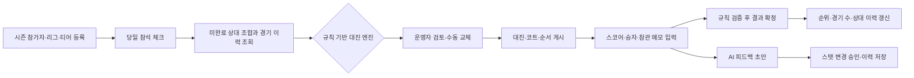

[squash_esl_ai_service_proposal.md](https://github.com/user-attachments/files/31102340/squash_esl_ai_service_proposal.md)
# 스쿼시 동아리 ESL AI 운영 서비스 설계 제안서

**작성자: Manus AI**  
**목적: ESL 대진·경기 기록·선수 피드백을 한 곳에서 운영하는 다중 사용자 웹서비스의 실현 가능성과 권장 설계 정리**

## 결론

제안하신 서비스는 **구현 가능합니다.** 다만 완성도가 높은 서비스가 되려면 역할을 분리해야 합니다. **대진 생성과 순위 계산은 규칙 기반 알고리즘**이 맡고, **비정형 기록 해석·경기 피드백·스크린샷 입력 보조는 AI**가 맡는 구조가 안전합니다. 즉, AI가 대진의 정답을 임의로 결정하는 서비스가 아니라, 운영자가 반복적으로 하던 입력·정리·해석을 줄여 주는 **ESL 운영 시스템 + AI 보조 에이전트**로 설계하는 것이 가장 현실적입니다.

가장 큰 제약은 카카오톡 단체채팅의 기본 **투표 생성·투표자별 결과 조회를 공식 API로 직접 자동화하기 어렵다**는 점입니다. 카카오의 공식 메시지 문서는 서비스 내 사용자에게 메시지를 보내는 기능을 중심으로 설명하며, 단체채팅 투표를 읽거나 생성하는 기능은 명시하지 않습니다. 또한 공식 개발자 커뮤니티의 관련 답변도 해당 기능을 제공하지 않는다고 안내합니다.[1] [2] 따라서 **참가 투표의 원본은 웹사이트**로 두고, 카카오톡은 공지·링크 유입 채널로 쓰는 방식을 권합니다. 카카오톡 화면 캡처 업로드는 보조 수단으로는 가능하지만, 자동 저장 전 **사람의 확인 단계**가 반드시 있어야 합니다.

> **핵심 원칙:** `규칙·점수·순위 = 결정적 코드`, `문장·이미지·피드백 = AI 초안`, `공식 확정 = 운영자 또는 권한 있는 사람이 승인`입니다.

| 영역 | 구현 가능성 | 권장 구현 방식 | AI의 역할 |
|---|---:|---|---|
| 시즌 참가 수요조사·확정 | 가능 | 회원이 시즌 참가 신청, 운영자가 확정 | 불필요 |
| 월·목 당일 참가 체크 | 가능 | 웹 링크에서 2탭으로 참석/불참 선택 | 리마인드 문구 생성 정도 |
| ESL 대진 생성 | 가능 | 제약조건 기반 알고리즘과 검증기 | 사용하지 않음 |
| 동일 대진 방지·경기 수 균형 | 가능 | 시즌 이력 DB 및 하드 제약 | 사용하지 않음 |
| 승점·득실·상대전적 순위 | 가능 | DB 집계와 정해진 타이브레이커 | 사용하지 않음 |
| 결과·스코어 기록 | 가능 | 대진 카드에서 직접 입력, 검증 후 확정 | 사진 인식은 보조 입력 |
| 카카오톡 투표 자동 수집 | 공식 API 기준 곤란 | 웹 투표를 원본으로 전환, 캡처 업로드 보조 | 캡처에서 후보 추출 |
| 선수 육각형 스탯 | 가능 | 선택 참여형 프로필과 변경 이력 | 코멘트에서 조정안·피드백 생성 |
| 프로필 이미지 | 가능 | 로그인 사용자별 이미지 업로드·접근권한 | 불필요 |

## 제공된 ESL 규칙에서 시스템화할 항목

제공하신 규칙에는 같은 리그 안에서 각 상대와 전·후반기에 각각 한 번씩 만나는 것을 원칙으로 하고, 개인의 하루 리그 경기는 최대 2경기이며 같은 날 동일 상대와 두 경기를 치를 수 없다고 되어 있습니다. 또한 1부 12명 예시에서는 전·후반기 각 9경기 이상, 2부는 인원 구성에 따라 전·후반기 최소 경기 수가 달라집니다. 따라서 숫자를 코드에 고정하지 말고 **시즌 설정값**으로 저장해야 합니다.

| 시즌 설정값 | 예시·설명 | 운영자가 정하는 이유 |
|---|---|---|
| 리그 | 1부, 2부, 향후 3부 | 서로 다른 리그의 ESL 인정전을 차단하기 위해 필요합니다. |
| 리그별 참가자 | 확정된 선수 목록 | 모든 가능한 상대 조합과 목표 경기 수의 기준입니다. |
| 전반기·후반기 기간 | 각 시작일·종료일, 월·목 경기일 | 첫 대결과 두 번째 대결의 배분 기준입니다. |
| 리그별 최소 경기 수 | 예: 전반기 9, 후반기 9 | 인원 변동이 있는 시즌에도 규칙을 유지합니다. |
| 1일 개인 최대 경기 수 | 기본값 2 | 피로도와 규칙 위반을 막습니다. |
| 코트 수·시간 슬롯 | 1~N코트, 18:40/19:00 등 | 실제로 동시에 배정 가능한 경기 수를 결정합니다. |
| 티어·성별 핸디캡 규칙 | 티어 차이당 2점, 남녀 2점 | 자동 안내와 결과 검증에 쓰되, 시즌마다 변경할 수 있게 합니다. |
| 경기 규칙 | 15점 단판·듀스, 2부 서브 미스 면제 | 경기 카드와 결과 입력 화면에 표시합니다. |

규칙 문서에는 2부 인원이 10명인 버전과 9명인 버전이 함께 보입니다. 이 때문에 시스템은 “2부 최소 경기 수 = 7”처럼 고정해서는 안 됩니다. **시즌 생성 시 운영자가 각 리그의 전·후반 최소 경기 수를 명시적으로 확정**하고, 이후 변경은 변경 이력에 남기도록 해야 합니다.

## 1. ESL 대진: AI가 아니라 검증 가능한 알고리즘으로

### 대진 알고리즘의 입력과 출력

월·목 당일의 참석자, 리그, 이미 치른 상대, 전·후반기별 누적 경기 수, 그날 가능한 코트·시간을 입력으로 사용합니다. 출력은 단순한 “누구 대 누구”가 아니라, **경기 순서·코트·예정 심판·핸디캡 안내·대체 후보**까지 포함한 당일 운영표입니다.

대진 엔진은 우선 가능한 모든 같은 리그 조합을 만든 뒤, 조건을 만족하는 조합만 남깁니다. 소규모 동아리 규모에서는 **정렬 기반 배정 + 교환 탐색(local search)**만으로도 충분히 빠르고 투명하게 운영할 수 있습니다. 참가자가 늘거나 코트·시간·불참 제약이 복잡해지면 수학적 제약 최적화 방식으로 확장할 수 있습니다. 어느 방식이든 결과마다 “왜 이 대진이 선택되었는지”를 보여 주면 운영자의 신뢰를 얻을 수 있습니다.

| 구분 | 대진 엔진이 반드시 지킬 조건 | 우선순위로 최적화할 항목 |
|---|---|---|
| 리그 | 같은 리그끼리만 ESL 대진 | 해당 없음 |
| 참석 | 해당 날짜에 `참석`을 확정한 사람만 배정 | 예비 참석자는 대체 후보로 표시 |
| 중복 | 같은 전·후반기에 동일 조합은 최대 1회 | 시즌 전체에서 상대별 만남을 균등하게 배분 |
| 일일 한도 | 개인당 최대 2경기 | 0경기인 참석자와 부족 경기자를 먼저 배정 |
| 당일 재대결 | 같은 날 같은 상대와 2경기 금지 | 최근에 만난 상대의 재매칭을 낮은 우선순위로 처리 |
| 기간 목표 | 전·후반기 최소 경기 수를 추적 | 마감이 가까운 사람의 부족분을 우선 보정 |
| 자원 | 코트·시간 슬롯을 초과하지 않음 | 대기시간과 심판 부담을 최소화 |

여기서 “중복 없는 대진”은 정확히 정의해야 합니다. **전반기에는 한 번, 후반기에는 한 번**이 원칙이므로 동일 두 선수의 전체 시즌 대결은 최대 2회가 정상입니다. 따라서 DB는 `시즌 + 전/후반기 + 선수 A + 선수 B`를 중복 불가 키로 두고, 선수 ID는 항상 작은 값부터 저장해 순서가 바뀐 중복을 막습니다.

### 경기 결과와 순위 계산

결과 입력 카드에는 선수명, 승자, 점수, 듀스 여부, 핸디캡, 기록자, 심판, 특이사항을 둡니다. 기록이 확정되면 승자 3점·패자 0점, 득실 차, 상대 전적, 상대 득실 차를 순서대로 계산합니다. 상대 전적의 세부 우선순위는 규칙 문서에 있는 `승 → 듀스승 → 듀스패 → 패`를 별도 필드로 저장해야 나중에 정확히 재계산할 수 있습니다.

점수 표기는 특히 주의해야 합니다. 티어와 성별 어드밴티지가 실제 스코어에 어떻게 반영되는지, 예를 들어 **시작 점수인지·최종 입력 점수인지·핸디캡을 포함한 승패 판단인지**를 시즌 시작 전에 한 문장으로 확정해야 합니다. 시스템에는 `원점수`, `핸디캡`, `공식 판정점수`를 분리해 남기는 것을 권합니다. 그래야 규칙 해석이 바뀌거나 분쟁이 생겨도 기록이 사라지지 않습니다.

## 2. 월·목 참석 확인과 카카오톡의 현실적인 역할

### 선택지 비교

반복적인 운영과 다중 사용자 관리가 필요한 서비스이므로, 당일 참석 여부를 카카오톡 투표에 묶어 두는 것보다 **동아리 웹의 체크인 화면을 단일 원장(Source of Truth)**으로 삼는 편이 훨씬 안정적입니다. 아래 선택지는 모두 가능하지만, 실제 사용 습관과 운영 부담에 따라 선택해야 합니다.

| 접근 방식 | 장단점 | 비용 | 설정 복잡도 |
|---|---|---|---|
| **A. 과제용 데모 웹서비스** | 정적 화면·예시 데이터·AI 피드백을 빠르게 구현할 수 있습니다. 실제 회원 로그인과 운영 자동화는 제한적입니다. | 매우 낮음 | 낮음 |
| **B. 실사용 웹 운영 시스템** | 로그인, 참가 체크, DB, 대진, 결과, 프로필을 한 원장으로 관리해 장기 운영에 적합합니다. | 관리형 DB·AI 호출 사용량에 따라 변동 | 중간 |
| **C. 카카오톡 + 폼/스프레드시트 보조 운영** | 구성원 습관에 맞고 도입이 쉽지만, 대진 이력·중복 방지·권한 관리가 분산됩니다. | 낮음 | 낮음 |

| 투표 입력 방식 | 권장도 | 실제 운영 방식 | 한계와 통제 방식 |
|---|---:|---|---|
| 웹 체크인 링크 | 매우 높음 | 카카오톡 공지에 링크를 올리고, 회원이 `참석/불참/대기`를 선택합니다. | 회원이 링크를 열어야 합니다. 알림·마감 시간을 명확히 표기합니다. |
| 카카오톡 투표 캡처 업로드 | 중간 | 운영자가 캡처를 올리면 AI가 이름·참석 후보를 추출하고 확인 화면을 제공합니다. | 오인식·동명이인·익명 투표가 있으므로 자동 확정 금지입니다. |
| 투표 결과 수기 입력 | 중간 | 운영자가 참석자만 체크박스로 빠르게 옮깁니다. | 가장 안정적이지만 반복 입력이 남습니다. |
| 카카오톡 투표 API 직접 연동 | 낮음 | 공식 지원만으로는 채택하지 않습니다. | 단체채팅 투표 생성·조회 API가 공식 제공되지 않는 것으로 확인됩니다.[1] [2] |

카카오톡 메시지 관련 공식 문서는 메시지 발송 기능을 안내하고 있으며,[1] 관련 공식 커뮤니티 답변은 투표 자동화 API를 제공하지 않는다고 명시합니다.[2] 따라서 “카카오톡 안에서 모든 것을 자동으로”보다 **카카오톡에는 공지와 링크, 웹에는 데이터와 확정**이라는 경계가 적합합니다. 나중에 알림 채널을 추가하고 싶다면 이메일·푸시 알림·동아리 공지 채널 등으로 확장할 수 있습니다.

월·목 아침 리마인드는 예약 실행으로 보낼 수 있습니다. Vercel의 공식 문서도 예약 작업이 함수 호출을 통해 반복 작업을 수행하는 구조를 지원한다고 안내합니다.[5] 다만 이 기능은 당일 “누가 참석할지”를 판단하는 것이 아니라, **마감 전 체크인 안내·마감 처리·운영자 미확정 알림**에만 사용해야 합니다.

## 3. 경기 결과 입력: 수기 입력을 기본, 이미지 AI를 보조로

대진 카드 안에서 운영자·심판이 직접 점수와 승자를 입력하는 UX가 기본입니다. 입력은 15점 이상, 듀스 규칙, 선수 일치, 중복 확정 여부를 즉시 검사합니다. 심판이 다음 경기 예정자라는 규칙은 자동 배정하되, 어려움이 있는 경우 운영자가 바꿀 수 있어야 합니다.

스크린샷 또는 전광판 사진에서 결과를 읽는 기능도 구현할 수 있습니다. 최신 멀티모달 AI API는 이미지를 입력으로 분석하는 기능을 제공합니다.[3] 그러나 사진 한 장만으로는 선수가 누구인지, 점수가 공식 핸디캡 적용 후인지, 오타인지 확정할 수 없습니다. 따라서 권장 흐름은 아래와 같습니다.

> **사진 업로드 → AI가 `선수 A·선수 B·점수·승자` 초안 생성 → 기존 대진과 자동 대조 → 운영자/심판이 한 번 탭하여 승인 → DB 확정**

AI가 생성한 값은 반드시 임시 상태로 저장하고, 신뢰도 낮음·선수명 불일치·점수 규칙 위반이면 빨간 표시와 함께 수기 입력으로 전환해야 합니다. 이 설계는 AI의 장점인 입력 시간 단축을 살리면서, 리그 기록의 신뢰성을 지킵니다.

## 4. 선수 스탯과 AI 피드백

### 권장 6각형 스탯

스탯은 “실력의 객관적 순위”가 아니라, 참여자가 자신의 경기 경향과 성장 포인트를 보는 **선택형 성장 프로필**로 정의하는 것이 좋습니다. 본인 동의가 있는 선수만 공개 프로필을 활성화하고, 비공개·본인만 보기·동아리 공개를 선택할 수 있게 합니다.

| 스탯 축 | 의미 | 관찰 메모 예시 |
|---|---|---|
| **포핸드 공격력** | 포핸드 드라이브·킬의 위력과 득점 전환 | “포핸드 크로스가 계속 득점으로 연결됐다.” |
| **백핸드 안정성** | 백핸드 드라이브·리턴의 실수 억제 | “백핸드 코너에서 짧아져 실점이 잦았다.” |
| **전위 터치** | 드롭·보스트·발리의 섬세함 | “짧은 드롭 후 다음 공을 잘 마무리했다.” |
| **랠리 컨트롤** | 깊이·길이·템포로 랠리를 지배하는 능력 | “뒤로 길게 보내며 상대를 묶어 뒀다.” |
| **기동·수비** | 코트 커버, 회복, 어려운 공 처리 | “후반에도 코너 공을 잘 건져 냈다.” |
| **서브·리턴 압박** | 서브 정확도, 리턴 주도권, 초반 전개 | “리턴이 짧아 주도권을 자주 넘겼다.” |

처음에는 50점 기준의 자기평가 또는 운영진의 간단한 초기평가로 시작합니다. 경기 결과만으로 “백핸드가 약하다”고 결론 내리면 안 됩니다. 결과는 승패일 뿐 기술별 증거가 아니기 때문입니다. **심판·참관 메모의 구체적인 근거**가 있을 때만 AI가 조정안을 내야 합니다.

### 안전한 AI 조정 로직

AI에는 자유문장 답변 대신 아래와 같이 제한된 구조화 출력을 요구합니다. 이렇게 하면 AI의 해석을 기록으로 남기고, 잘못된 판단을 되돌릴 수 있습니다.

| 단계 | 처리 | 통제 장치 |
|---|---|---|
| 1. 입력 | 특이사항 메모, 해당 경기의 선수·점수·기존 스탯 | 메모 작성자·경기 ID를 함께 보관 |
| 2. AI 분석 | 근거 문장, 관련 스탯 축, 제안 변화량, 신뢰도, 선수별 한 줄 피드백 생성 | 입력 메모 밖의 사실을 추측하지 않도록 지시 |
| 3. 규칙 검증 | 한 경기당 축별 변화량을 예: -2~+2로 제한 | 욕설·인신공격·모호한 평가는 보류 |
| 4. 승인 | 운영자 또는 선수 본인이 ‘적용/수정/무시’를 선택 | 처음부터 자동 반영하지 않음 |
| 5. 이력 | 이전 값, 제안 값, 승인자, 근거, 날짜 보관 | 언제든 되돌리기 가능 |

예를 들어 “백핸드에서 실수가 세 번 나왔지만, 포핸드 드라이브로 후반 흐름을 되찾았다”라는 메모가 입력되면, AI는 `백핸드 안정성 -1`, `포핸드 공격력 +1`을 **제안**하고 그 근거를 문장으로 보여 줄 수 있습니다. 누적 데이터가 충분해지고 운영진이 결과를 신뢰하게 된 뒤에만 “신뢰도 높음 + 두 명 이상의 독립된 메모” 같은 조건을 만족할 때 반자동 적용을 검토하는 순서가 좋습니다.

이 기능은 과제의 AI 요구사항에도 매우 적합합니다. 사용자가 관찰 메모를 입력하면 AI가 구조화된 스탯 조정안과 피드백을 화면에 반환하고, 빈 입력·응답 지연·AI 오류·형식 오류에는 명확한 안내를 표시하면 됩니다. AI 키는 브라우저에 넣지 않고 서버의 환경 변수로만 관리해야 합니다.

## 5. 다중 사용자 데이터·권한 설계

실사용 서비스라면 표 형태의 데이터베이스가 반드시 필요합니다. 선수, 시즌, 리그, 참가 상태, 대진, 결과, 관찰 메모, 스탯 변경은 모두 서로 연결됩니다. 인증·관계형 데이터·프로필 이미지 저장을 제공하는 관리형 백엔드를 붙이는 편이 구현과 운영 모두 수월합니다. 예를 들어 Supabase는 PostgreSQL 기반의 행 단위 보안 정책을 제공하며, 공개 스키마의 테이블에는 RLS를 활성화해야 한다고 안내합니다.[4] 이는 선수 개인 프로필과 운영자 권한을 분리하는 데 적합합니다.

| 데이터 묶음 | 핵심 필드 | 중요 제약 |
|---|---|---|
| `users / players` | 이름, 로그인 ID, 프로필 이미지, 공개 범위, 성별, 티어 | 민감한 필드는 권한 있는 사람만 편집 |
| `seasons / leagues` | 기간, 리그, 최소 경기 수, 규칙 버전 | 규칙 변경 시 버전을 남김 |
| `season_entries` | 시즌 참가 여부, 리그, 확정 상태 | 확정 후 리그 변경은 운영자 승인 |
| `attendance` | 날짜, 참석 상태, 응답 시각 | 마감 후 변경은 이력에 기록 |
| `matches` | 전·후반기, 선수 A/B, 코트, 시간, 상태 | 전·후반기 내 같은 조합 중복 불가 |
| `results` | 원점수, 핸디캡, 공식 승자, 확정자 | 확정 결과 수정은 사유 필수 |
| `observations` | 경기 ID, 작성자, 대상 선수, 메모 | 공개 범위와 신고 기능 필요 |
| `stat_revisions` | 이전값, 제안값, 근거, AI 신뢰도, 승인자 | 모든 변경을 되돌릴 수 있어야 함 |

| 역할 | 할 수 있는 일 | 할 수 없게 할 일 |
|---|---|---|
| 일반 회원 | 본인 출석 응답, 공개 대진·순위 보기, 본인 프로필·사진 편집 | 타인의 티어·공식 결과·스탯 확정 수정 |
| 선수 | 일반 회원 권한 + 본인 스탯 제안 수락/비공개 설정 | 본인 경기 결과의 단독 확정 |
| 심판·기록자 | 지정 경기의 결과·메모 초안 입력 | 시즌 규칙·순위표 직접 수정 |
| 운영진 | 대진 생성·교체·결과 확정·스탯 승인·권한 관리 | 삭제 이력 없는 무단 수정 |
| 관리자 | 시즌 생성, 리그·규칙 설정, 데이터 복구 | 해당 없음 |

권한은 화면 버튼을 숨기는 것만으로 처리하면 안 됩니다. 서버와 데이터베이스에서도 같은 권한을 검사해야 합니다. 특히 운영자용 비밀키는 브라우저 코드에 절대 넣지 않고, AI 호출과 대진 확정은 서버 API를 통해 실행해야 합니다.

## 6. 예쁘면서도 실제로 쓰기 쉬운 UI 방향

예쁜 화면보다 중요한 것은 **월·목 저녁의 20초짜리 행동**입니다. 회원은 참석 여부를 빠르게 누르고, 운영진은 누락 없이 대진을 확정하며, 심판은 경기 후 즉시 결과를 저장할 수 있어야 합니다. UI 콘셉트는 짙은 코트 그린 또는 차콜 배경 위에 테니스공 옐로우·라임 포인트를 쓰는 “**Midnight Court**”를 제안합니다. 다만 포인트 색은 알림·승인·강조에만 쓰고, 기본 정보는 높은 대비의 흰색·회색 텍스트로 제공해야 합니다.

| 화면 | 최우선 행동 | 핵심 UI 요소 |
|---|---|---|
| 오늘의 ESL | 오늘 참석 확인 | `참석 / 불참 / 대기` 3개 큰 버튼, 마감 카운트다운, 내 예상 경기 수 |
| 대진 보드 | 경기 순서 확인·결과 입력 | 코트별 카드, 선수 사진/이름, 핸디캡 배지, 승자·점수 빠른 입력 |
| 리그 현황 | 내 진행률 확인 | 승점표, 전·후반 최소 경기 게이지, 아직 만나지 않은 상대 |
| 선수 프로필 | 성장 피드백 확인 | 6각형 레이더 차트, 최근 변화 타임라인, AI 피드백 근거 |
| 운영진 콘솔 | 확정·예외 처리 | 참석자 목록, 대진 생성 버튼, 충돌 사유, 드래그 교체, 승인 큐 |

모바일에서는 하단 메뉴를 `오늘 · 체크인 · 대진 · 리그 · 내 프로필`로 고정하고, 화면 상단에는 “오늘 내가 할 일” 한 가지만 보여 주는 것이 좋습니다. 데스크톱 운영진 화면은 좌측 탐색 메뉴와 중앙 대진 보드, 우측 충돌·미확정 패널의 3열 구조가 효율적입니다. 표는 모바일에서 그대로 축소하지 말고 **경기 카드와 아코디언**으로 바꾸어야 합니다.

프로필 육각형은 시각적으로 멋지지만, 숫자만 보여 주면 비교·경쟁 압박이 생길 수 있습니다. 각 축 아래에 “최근 근거”와 “다음 연습 포인트”를 함께 보여 주고, 다른 사람의 수치는 동의한 경우만 공개하는 설계가 바람직합니다. 또한 색만으로 승패·상태를 구분하지 말고 아이콘과 텍스트를 병기해야 합니다.

## 7. 권장 기술 구성

과제 문서의 조건인 **바닐라 HTML/CSS/JavaScript 프론트엔드, Python 서버리스 API, Vercel 배포**와 양립하도록 설계할 수 있습니다. 프레임워크 없이도 충분하며, 초기에는 화면과 API를 명확히 분리하면 학습 목표도 충족합니다.

| 구성 요소 | 과제·MVP에서의 선택 | 실사용 확장 시 역할 |
|---|---|---|
| 화면 | 바닐라 HTML/CSS/JavaScript | 반응형 UI, 대진 카드, 레이더 차트, 폼 검증 |
| 배포·API | Vercel + `api/*.py` | 대진 생성, 결과 검증, AI 분석, 예약 리마인드 |
| 데이터·로그인·이미지 | 관리형 PostgreSQL + 인증 + 파일 저장소 | 다중 사용자, 결과 이력, 프로필 이미지, 권한 정책 |
| 대진 엔진 | 순수 Python의 조합 생성·점수화·교환 탐색 | 제약이 커지면 최적화 엔진으로 확장 |
| AI | 텍스트/이미지 입력을 받는 멀티모달 모델 API | 메모 분석, 스크린샷 초안 추출, 피드백 생성 |
| 품질 보장 | 단위 테스트 + 대진 검증 리포트 | 같은 대진·일일 3경기·최소경기 오판을 배포 전 차단 |

API는 최소한 `POST /api/generate-matchups`, `POST /api/record-result`, `POST /api/analyze-observation`으로 나누는 편이 좋습니다. 모든 API는 로그인 사용자와 역할을 확인하고, 대진·결과 확정처럼 중요한 변경에는 변경 사유와 감사 로그를 남겨야 합니다. 이미지 AI는 이미지 입력을 지원하는 API를 통해 구현할 수 있지만,[3] 모델 비용과 응답 지연을 고려해 사용자가 명시적으로 “사진에서 읽기”를 눌렀을 때만 호출해야 합니다.

## 8. 장벽과 선행 결정

기술보다 먼저 정해야 할 운영 규칙이 있습니다. 이 결정을 하지 않으면 어떤 알고리즘도 “맞는 대진”을 보장할 수 없습니다.

| 장벽 | 왜 문제인가 | 출시 전 결정·대응 |
|---|---|---|
| 인원·최소 경기 수 미확정 | 대진 엔진의 목표 함수가 달라집니다. | 시즌별 리그 인원·전/후반 최소 경기 수·코트 수를 설정 화면으로 만듭니다. |
| 갑작스러운 불참 | 확정 대진이 깨지고 경기 수 균형이 무너집니다. | 마감 시각, 대기자, 1탭 재생성, 불참 이력을 정의합니다. |
| 핸디캡 판정 방식 | 결과·순위 분쟁으로 이어질 수 있습니다. | 원점수/핸디캡/공식점수의 정의를 규칙에 명문화합니다. |
| 카카오톡 투표 API 부재 | 단체 투표를 자동 원장으로 쓸 수 없습니다. | 웹 체크인을 원본으로 두고, 카카오톡은 링크·캡처 보조로 한정합니다.[1] [2] |
| AI 오인식·환각 | 잘못된 선수·점수·스탯이 저장될 수 있습니다. | 임시 저장, 신뢰도, 대조, 승인, 되돌리기 순서를 강제합니다. |
| 스탯의 주관성·관계 갈등 | 피드백이 평가·비난으로 받아들여질 수 있습니다. | 선택 참여, 근거 표시, 변화량 제한, 신고·비공개·승인권을 제공합니다. |
| 개인정보·사진 | 성별·프로필 사진·경기 기록은 개인 데이터입니다. | 공개범위, 삭제 요청, 이미지 접근권한, 최소 수집 원칙을 적용합니다. |

## 9. 단계별 구현 로드맵

### 단계 1 — 과제 제출에 적합한 작동형 프로토타입

최소 4개 화면인 `오늘의 ESL`, `대진`, `리그 현황`, `선수 프로필`을 만듭니다. 예시 참가자와 경기 기록을 넣고, 참석자 선택 후 규칙 기반 대진 초안을 생성합니다. AI 기능은 **특이사항 메모 → 6개 스탯의 제안 변화량 + 한 줄 피드백**으로 구현합니다. 빈 메모, AI API 오류, 지연, 형식 오류를 화면에서 처리합니다. 이 단계만으로도 과제의 페이지 수, 반응형, Python API, AI 입력→출력, GitHub·Vercel 배포 조건에 맞출 수 있습니다.

### 단계 2 — 실제 ESL 한 시즌을 운영할 수 있는 MVP

로그인, 시즌/리그 생성, 참가 확정, 당일 체크인, 결과 확정, 순위표, 감사 로그를 추가합니다. 이때부터 데이터는 브라우저 저장소가 아닌 중앙 DB에 저장합니다. 운영자가 먼저 1~2회차를 병행 운영하면서 실제 불참·대기자·코트 수 예외를 모아 대진 우선순위를 조정합니다.

### 단계 3 — 운영 자동화와 AI 보조 고도화

월·목 리마인드, 마감 경고, 부족 경기 수 알림, 스크린샷 결과 인식, AI 피드백 승인 큐를 추가합니다. AI가 대진이나 공식 결과를 단독 확정하지 않도록 유지하고, 운영자가 자주 수정한 항목을 분석해 알고리즘 규칙 자체를 개선합니다.

### 단계 4 — 참여 경험 고도화

QR 체크인, 개인 일정 내보내기, 푸시 알림, 시즌 리포트, 상대별 전적, 성장 타임라인, 동아리 공지 연결을 검토합니다. 이 단계에서 이용 패턴이 충분히 생긴 뒤에만 별도 모바일 앱을 고려하는 것이 비용 대비 효율적입니다.

## 웹사이트보다 나은 아이디어가 있는가?

처음부터 별도 네이티브 앱이나 카카오톡 챗봇을 만드는 것보다, **웹사이트를 운영 원장으로 두고 카카오톡을 유입·공지 채널로 연결하는 방식**이 더 낫습니다. 웹은 대진 보드·경기 기록·권한·프로필·대시보드처럼 복잡한 정보를 표현하기 좋고, 설치 없이 링크만으로 접근할 수 있습니다. 홈 화면에 추가하면 앱처럼 열리는 PWA 형태도 나중에 지원할 수 있습니다.

가장 좋은 제품 정의는 “AI 챗봇”보다 **`ESL MatchOps: 참가 체크부터 기록·성장까지 이어지는 동아리 경기 운영 시스템`**입니다. AI는 화면의 주인공이 아니라 운영 흐름을 부드럽게 만드는 조력자여야 합니다. 특히 초기에는 AI보다도 “오늘 참석 버튼”, “대진 확정 버튼”, “결과 입력 버튼”이 빠르고 신뢰할 수 있어야 구성원이 계속 사용합니다.

## 시작 전에 확정하면 좋은 네 가지

1. **당일 코트 수와 각 코트의 운영 시간 슬롯**은 몇 개인가요? 이 값이 한 번에 생성할 수 있는 경기 수를 결정합니다.
2. **티어·성별 2점 어드밴티지**는 시작 점수, 최종 판정점수, 혹은 별도 점수 중 무엇에 적용되나요?
3. **경기 결과 확정권자**는 심판, 두 선수, 운영진 중 누구인가요? 이 답이 분쟁 처리 UX를 결정합니다.
4. 선수 스탯은 **본인만 보기·동아리 공개·완전 비공개** 중 어떤 공개정책을 기본값으로 할까요?

## 참고자료

[1]: https://developers.kakao.com/docs/en/kakaotalk-message/rest-api "Kakao Developers — Kakao Talk Message REST API"
[2]: https://devtalk.kakao.com/t/api/142759 "카카오 데브톡 — 카카오톡 투표 API"
[3]: https://developers.openai.com/api/docs/guides/images-vision "OpenAI API — Images and vision"
[4]: https://supabase.com/docs/guides/database/postgres/row-level-security "Supabase Docs — Row Level Security"
[5]: https://vercel.com/docs/cron-jobs "Vercel Docs — Cron Jobs"
